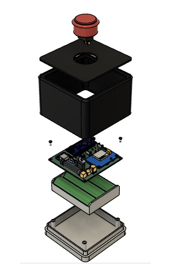

# Integrated Documentation: Remote Emergency Meeting Scheduling Device

This comprehensive documentation merges two interconnected projects, combining IoT-enabled emergency scheduling with a Flask application to manage Google services. Together, they offer a robust solution for automating critical communication tasks.

---

## Project Overview

### License

This project is licensed under the Apache License 2.0. You may obtain a copy of the License at:

[Apache License 2.0](http://www.apache.org/licenses/LICENSE-2.0)

Unless required by applicable law or agreed to in writing, software distributed under the License is distributed on an "AS IS" BASIS, WITHOUT WARRANTIES OR CONDITIONS OF ANY KIND, either express or implied. See the License for the specific language governing permissions and limitations under the License.

---


### Remote Emergency Meeting Scheduling Device
An open-source IoT solution designed to automate emergency meeting scheduling. It integrates seamlessly with Google Meet, SMS triggers, and email notifications to enhance reliability and efficiency.

### Flask Application
A lightweight web application utilizing Google services to automate calendar and spreadsheet management, with SMS processing to trigger calendar invites.

---

## Features

### IoT Device Highlights
- **SMS Trigger**: Activates the backend server via Twilio to initiate emergency meeting scheduling.
- **Battery Efficiency**: Operates for over a year on a single battery.
- **Design Optimization**: Iteratively developed for enhanced functionality and aesthetics.
- **Complete Resources**: Includes PCB designs, 3D models, schematics, and manufacturing files.

### Backend Capabilities
- **Google Workspace Integration**: Automates Google Meet scheduling and retrieves client data from Google Sheets.
- **Email Notifications**: Sends meeting details to participants promptly.
- **Scalability**: Handles multiple requests in real-time.

### Flask App Features
- **Google Calendar Management**: Creates and customizes Google Calendar events, including attendees, timings, and reminders.
- **Spreadsheet Management**: Reads, writes, and appends data dynamically to Google Sheets.
- **SMS Processing**: Logs SMS data, retrieves client details, and triggers calendar invites based on the content.

---

## Installation

### Prerequisites
- **Software**: Python 3.8+
- **Google APIs**: Enable Calendar and Sheets APIs in the Google Cloud Console.
- **API Accounts**: Twilio account for SMS handling; OAuth credentials for Google services.

### Setup Steps

#### Clone the Repository
```bash
git clone <repository_url>
cd <repository_folder>
```

#### Install Dependencies
```bash
pip install -r requirements.txt
```

#### Configure API Credentials
- Save the credentials JSON file from Google Cloud in the project directory.
- Add API keys and credentials in `config.py`:
  ```python
  CREDENTIAL_FILE = 'path_to_credentials.json'
  CALENDAR_TOKEN = 'your_calendar_scope'
  SHEET_TOKEN = 'your_sheet_scope'
  GOOGLE_SHEET = 'spreadsheet_id'
  ```

#### Start the Server
```bash
python app.py
```

---

## Usage

### IoT Device
1. Activate the device to send an SMS trigger to the backend.
2. The backend:
   - Retrieves client details from Google Sheets.
   - Schedules a Google Meet session.
   - Sends email notifications to participants.

### Flask App

#### Calendar Management
- Use the `set_calendar` function to create events:
  ```python
  from modules.calendar_v1 import set_calendar

  invitees = ["example1@gmail.com", "example2@gmail.com"]
  set_calendar(invitees)
  ```

#### Google Sheets Management
- Perform operations with the `GoogleSheets` class:
  ```python
  from modules.sheets_v1 import GoogleSheets

  gs = GoogleSheets()
  # Read data
  data = gs.read_data("Sheet1", "A1:C10")
  print(data)
  # Write data
  values = [["Name", "Age"], ["Alice", 25], ["Bob", 30]]
  gs.write_data("Sheet1", "A1", values)
  # Append data
  new_rows = [["Charlie", 35]]
  gs.append_data("Sheet1", new_rows)
  ```

#### SMS Processing
- Endpoint for SMS:
  ```bash
  /emergency-button/inbound-emergency
  ```
- Example payload:
  ```json
  {
    "From": "+1234567890",
    "To": "+0987654321",
    "Body": "button_id,event_type,battery_health"
  }
  ```
- Functionality:
  - Logs SMS details to the `SMS Logs` sheet.
  - Retrieves client emails from the `Client Info` sheet.
  - Triggers calendar invites based on the SMS content.

---

## GoogleAuthenticator Class for Google API Authentication

### Description
The `GoogleAuthenticator` class is designed to streamline authentication with Google API services. It handles token management, credential verification, and API service building, making it easier to integrate with Google services like Calendar and Sheets.

### How It Works

#### Authentication Process
- Ensures tokens are valid or refreshes them if expired.
- Launches a local server to authenticate and save credentials if no token exists.
- Saves credentials for future use.

#### Service Building
- Builds a Google API service using authenticated credentials for interaction with APIs like Calendar and Sheets.

#### Example Use
- Authenticate and initialize Calendar API service:
  ```python
  from services.authenticator import GoogleAuthenticator

  auth = GoogleAuthenticator(service_name='calendar', version='v3')
  credentials = auth.get_authenticated(token_path='path/to/token.json', scope=['https://www.googleapis.com/auth/calendar'])
  calendar_service = auth.auth_build('calendar', 'v3', credentials)
  print("Calendar API initialized.")
  ```

---

## Code Structure

```
project_root/
    |- app/
    |   |- modules/
    |   |   |- calendar_v1.py   # Manages Google Calendar events
    |   |   |- sheets_v1.py     # Manages Google Sheets interactions
    |   |- services/
    |       |- authenticator.py # Google API authentication utility
    |   |- routes/
    |       |- sms.py           # Handles SMS processing and calendar integration
    |   |- config.py                 # Configuration file for environment variables
    |- app.py # Entry point
```


---

## Future Improvements

- Enhance error handling for API operations.
- Add support for additional notification methods and triggers.
- Integrate further Google APIs for expanded functionality.
- PCB modifications for better user experience.


## IoT Device Code Highlights

### Key Functionalities
The Arduino code is designed to efficiently manage emergency meeting triggers. Below are the main highlights:

#### 1. **Low Power Mode**
The device leverages the `LowPower` library to maximize battery life by entering sleep mode when inactive.  
Example:
```cpp
#include "LowPower.h"

void sleepNow() {
    LowPower.powerDown(SLEEP_8S, ADC_OFF, BOD_OFF);  // Sleep for 8 seconds
}
```

#### 2. **Button Press Handling**
An interrupt is used to detect button presses and wake the device from sleep mode.
```cpp
const int buttonPin = 2;
volatile bool buttonPressed = false;

void setup() {
    attachInterrupt(digitalPinToInterrupt(buttonPin), wakeUp, FALLING);  // Attach interrupt
}

void wakeUp() {
    buttonPressed = true;  // Set flag on button press
}
```

#### 3. **SIM800L Communication**
The device uses `SoftwareSerial` to communicate with the SIM800L module for sending SMS triggers.
```cpp
#include <SoftwareSerial.h>

SoftwareSerial mySerial(3, 4);  // SIM800L Tx & Rx connected to pins 3 & 4

void sendSMS() {
    mySerial.begin(9600);
    mySerial.print("AT+CMGF=1
");  // Set SMS mode
    mySerial.print("AT+CMGS="+1234567890"
");  // Specify recipient
    mySerial.print("Emergency meeting triggered.
");  // Message content
    mySerial.write(26);  // End message with CTRL+Z
}
```

### Full Code
The complete code is available in the GitHub repository.
---



---

## Done By

This project was created and maintained by:

- [GitDevKarim](https://github.com/GitDevKarim)
- [DesignsByMalek](https://github.com/DesignsByMalek)

Feel free to reach out to us for any questions or contributions!


<div style="display: flex; justify-content: center; align-items: center;">
  <div style="text-align: center; margin-right: 20px;">
    <h3>GitDevKarim</h3>
    <span style="display: inline-block; margin-right: 10px;">
      <a href="https://github.com/GitDevKarim">
        
      </a>
    </span>
    <span style="display: inline-block;">
      <a href="https://linkedin.com/in/karim-jibai001">
        
      </a>
    </span>
  </div>

  <div style="height: 50px; width: 1px; background-color: #000;"></div>

  <div style="text-align: center; margin-left: 20px;">
    <h3>DesignsByMalek</h3>
    <span style="display: inline-block; margin-right: 10px;">
      <a href="https://github.com/DesignsByMalek">
        
      </a>
    </span>
    <span style="display: inline-block;">
      <a href="http://www.linkedin.com/in/malek-itani-3a346b269">
        
      </a>
    </span>
  </div>
</div>
